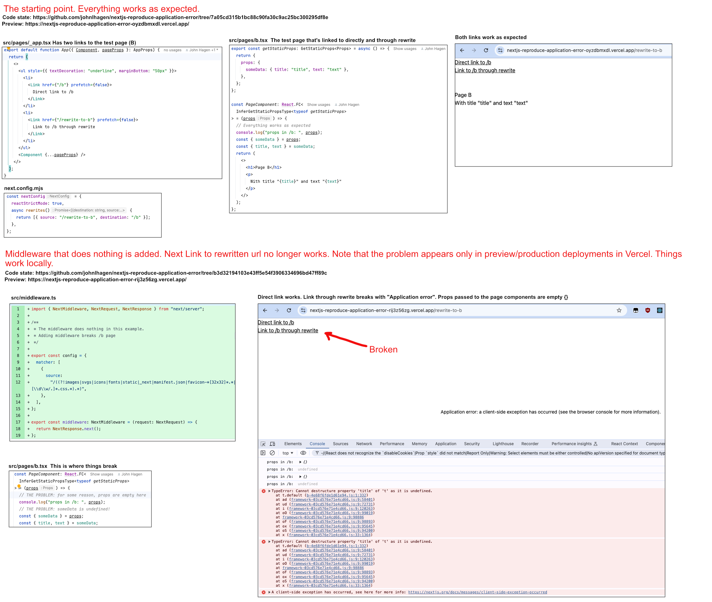

This is a [Next.js](https://nextjs.org/) project bootstrapped with [`create-next-app`](https://github.com/vercel/next.js/tree/canary/packages/create-next-app).

- Commit 7a05cd315b1bc88c90fa30c9ac25bc300295df8e sets up the test case.
- Commit b3d32194103e43ff5e54f3906334696bd47ff89c adds middleware and breaks the test case.
- Locally, everything works. When deployed with Vercel to preview or production, things break.
- Navigate to the latest deployment https://nextjs-reproduce-application-error.vercel.app/ and click on "Link to /b through rewrite". "Application error" is thrown.

